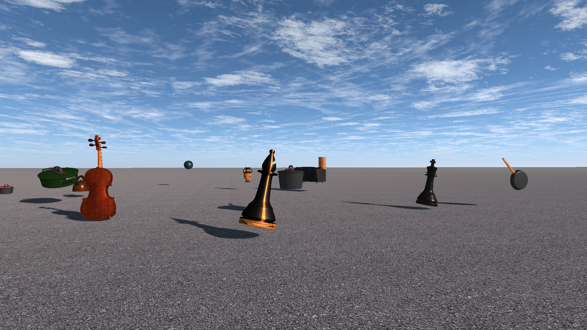
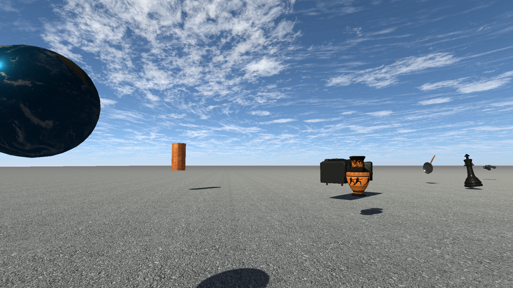
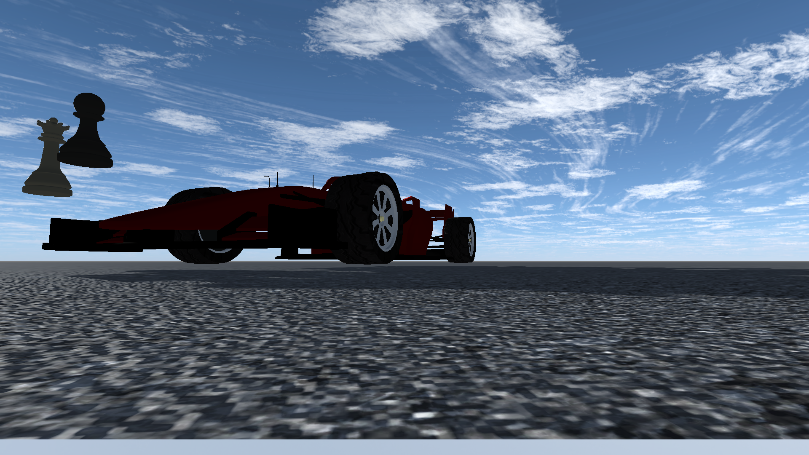
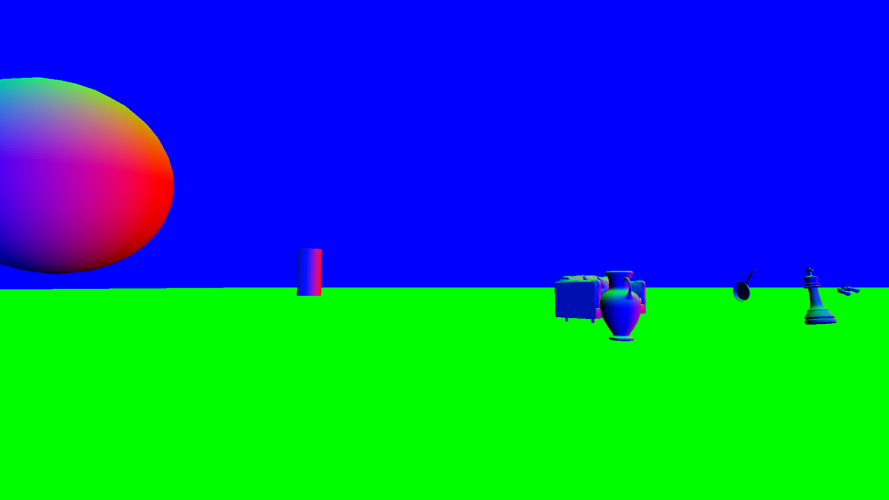
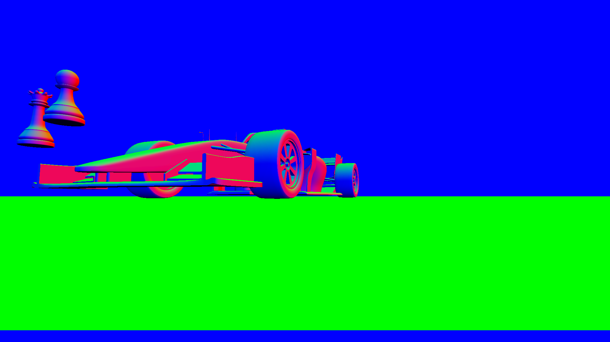
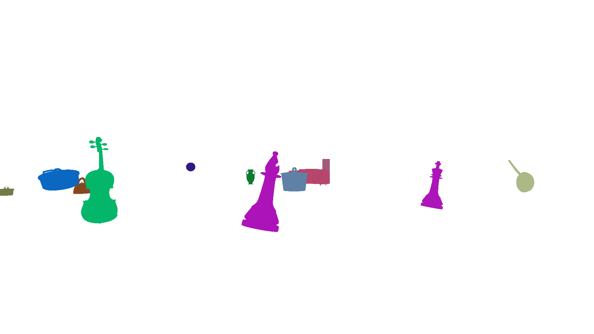
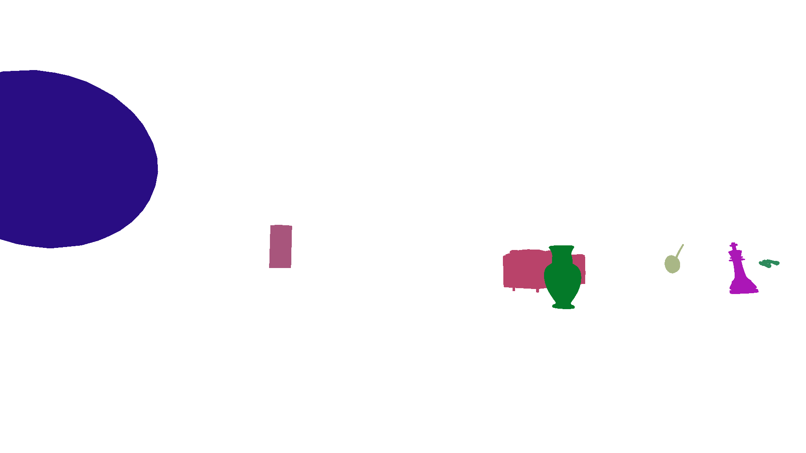

# Synthetic dataset generation for 3D light estimation
A unity project that can be used to automatically create a dataset of images of simple but realistic CGI rendered objects in a outdoor scene, along with their lighting informations. The lighting is composed only of an infinitely far away directional light (such as the sun).  
The object masks are also produced for segmentation purposes.

  
   
  

  
   
  

  
   
  

  
   
  

