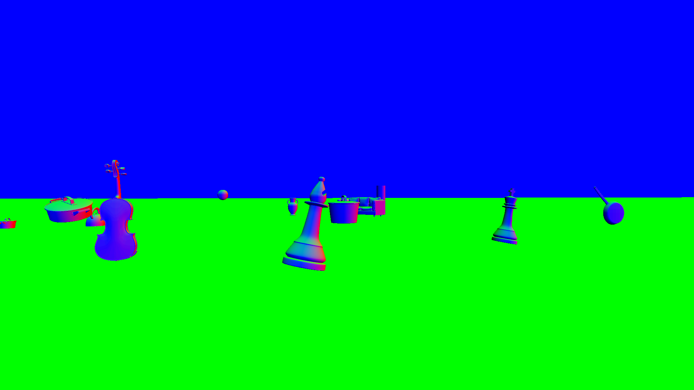
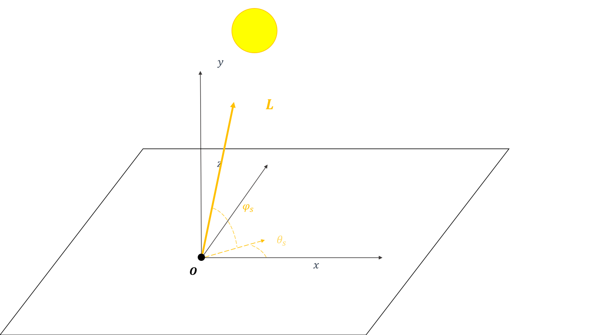

# Synthetic dataset generation for 3D light estimation
A unity project that can be used to automatically create a dataset of images of simple but realistic CGI rendered objects in a outdoor scene, along with their lighting informations. The lighting is composed only of an infinitely far away directional light (such as the sun). </br>
The object masks are also produced for segmentation purposes.

The generated dataset with this code can be freely downloaded here [SynthOutdoor-dataset](https://www.scidb.cn/en/detail?dataSetId=304a5d88dba04226957b6215c171c0c2).


<p float="center">
  
   
  
</p>

<p float="center">
  
   
  
</p>

<p float="center">
  
   
  
</p>

<p float="center">
  
   
  
</p>


## How to run the project and generate the dataset
1. [Download Unity 3d](https://unity.com/products) and install it.
2. Clone this repository. From a Powershell or Cmd terminal (Windows) or Bash shell (Linux), run the command:
   ```
   git clone https://github.com/marza1993/SynthOutdoor.git
   ```
3. Import this project inside Unity.
4. Create an empty root folder that will contain the generated dataset, *E.g.,: SynthOutdoor*. Inside this folder, create three sub-folders: *images*, *normals* and *masks*.
5. In the `Assets\scripts\GameHandler.cs`, modify the output path variables according to the created folder structure in the previous point:
    ```
    public static string img_path = @"C:\Users\mar-z\progetti\data\SynthOutdoor\images\";
    public static string mask_path = @"C:\Users\mar-z\progetti\data\SynthOutdoor\masks\";
    public static string normals_path = @"C:\Users\mar-z\progetti\data\SynthOutdoor\normals\";
    public static string fileName = @"C:\Users\mar-z\progetti\data\SynthOutdoor\light.csv";
    ```
 6. Run the code from the Unity interface.

## Acknowledgments
If you intend to use this code in a research paper, you must cite our work as:


```
@article{SynthOutdoor,
  title={SynthOutdoor: a synthetic dataset for 3D outdoor light estimation},
  author={Zanardelli, M., Gohari, M., Leonardi, R., Benini, S., Adami, N.},
  journal={Data in brief},
  year={2024},
  publisher={Elsevier}
}
```


